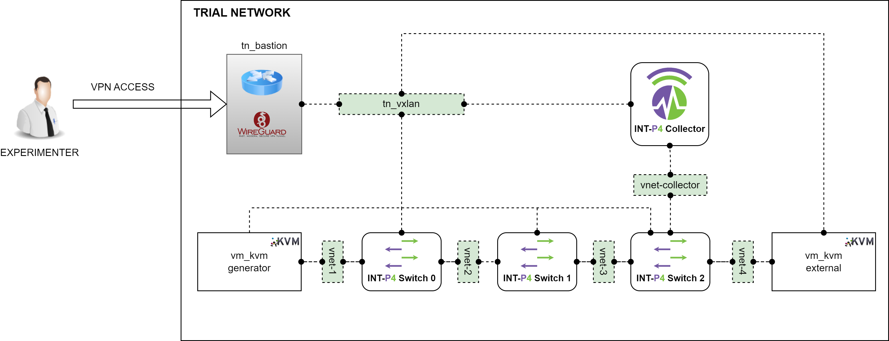

# INT-P4 Software Component
The INT-P4 SW component implements In-band Network Telemetry (INT) functionality using P4, enabling real-time network performance monitoring without affecting data traffic.


## 📚 What is INT-P4 SW?
INT-P4 SW is a software-based implementation of in-band telemetry that allows collecting detailed information about network state as traffic flows through it. Using P4 to program data plane behavior, this component can insert, collect, and process telemetry metadata in real-time.

## ✨ Key Features

* **P4-based Data Plane:** The data plane logic is defined using the P4 language, providing fine-grained control over packet processing and forwarding.
* **INT Switch Types:** Supports three types of switches:
  * **Source:** Initiates telemetry by inserting INT headers
  * **Transit:** Adds telemetry information as packets pass through
  * **Sink:** Extracts and reports collected telemetry information
* **INT Collector:** Includes a dedicated collector that receives, processes, and stores telemetry data. Based on the [int-collector](https://github.com/GEANT-DataPlaneProgramming/int-collector).
* **BMv2 Integration:** The P4 program runs on the BMv2 virtual switch, facilitating development and testing
* **Data Visualization:** Integration with InfluxDB and Grafana for metric storage and visualization

## 📝 Configuration
The INT-P4 SW component's configuration is managed through files located at `/home/jenkins/config`. This directory contains all necessary files to configure the behavior of INT-P4 switches and collector.

> [!NOTE]
> All these configuration files are **automatically configured when deploying the component** according to the parameters entered by the experimenter through the TNLCM. The description in this section is only in case you want to modify them manually.

### Configuration Directory Structure

#### 1. `/home/jenkins/config/controller-int/`

- **Description**: Contains the configuration for the INT-P4 controller
- **Key File**: `config.yaml`
  - **Purpose**: Defines parameters for each INT switch type
  - **Configurations Include**:
    - **Source Switch**:
      - Ingress port
      - Egress port
      - Metadata length
      - Maximum hop count
      - Instruction mask
    - **Transit Switch**:
      - Switch ID
    - **Sink Switch**:
      - Reporting port
      - Collector configuration
    - **Forwarding Rules**:
      - Destination MAC addresses
      - Output ports
      - Priorities

#### 2. `/home/jenkins/config/stratum-int/`

- **Description**: Contains P4 data plane configuration
- **Key Files**:
  - `chassis_config.pb.txt`
    - **Purpose**: Defines physical and virtual port mappings
    - **Configurations**:
      - Port IDs
      - Associated network interfaces
  - Other P4-specific configuration files

### Applying Configuration Changes

To apply configuration changes:

1. **Navigate to Docker Compose Directory**:
   ```bash
   cd /home/jenkins/
   ```

2. **Stop the Containers**:
   ```bash
   docker compose down
   ```

3. **Start Services with New Configuration**:
   ```bash
   docker compose up -d

## 📋 Logs

### Accessing Component Logs

For INT-P4 switches:
```bash
# Data plane logs (Stratum BMv2)
docker logs int-p4-bmv2-stratum-optimized

# Control plane logs
docker logs p4-int-controller-bmv2
```

For INT collector:
```bash
# View logs in real-time
tail -f /var/log/int_collector.log
```

