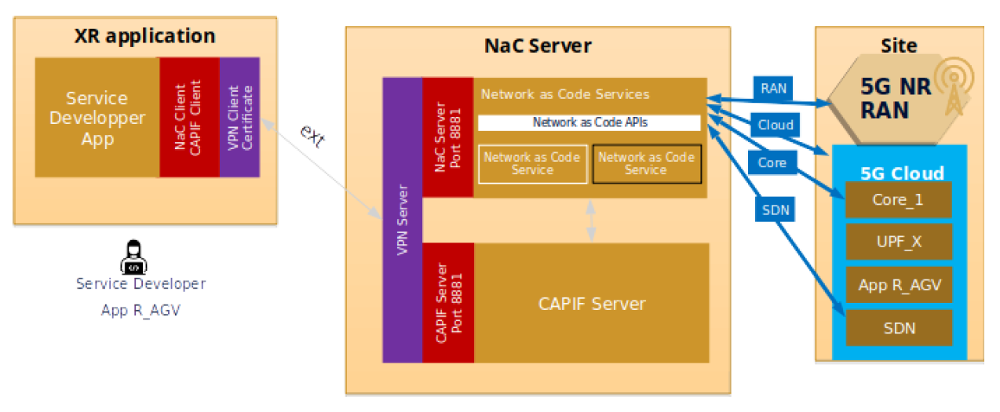

# XRext

The **XRext** 6G-Library component allows the experimenters to deploy their own Appliance for testing XR sessions, using Nokia's Network as Code (NaC) API, on top of the 5G network deployed in the UMA site.
The appliance only interacts with the NaC + CAPIF server deployed at the UMA, for which it is possible to use its input values ​​to define locations, credentials, etc. In particular, the parameters are as follows:
  - ONEAPP_XR_NAC_SERVER_IP: NaC server IP address
  - ONEAPP_XR_NAC_SERVER_PORT: NaC server port
  - ONEAPP_XR_NAC_SERVER_UNAME: NaC server username
  - ONEAPP_XR_NAC_SERVER_PASSWORD: NaC server password
  - ONEAPP_XR_CAPIF_HTTP_HOST: CAPIF http URL
  - ONEAPP_XR_CAPIF_HTTP_PORT: CAPIF http port
  - ONEAPP_XR_CAPIF_HTTPS_HOST: CAPIF https URL
  - ONEAPP_XR_CAPIF_HTTPS_PORT: CAPIF https port
  - ONEAPP_XR_CAPIF_UNAME: CAPIF register username
  - ONEAPP_XR_CAPIF_PASSWORD: CAPIF register password
  - ONEAPP_XR_CAPIF_INVOKER_ID: CAPIF invoker ID
  - ONEAPP_XR_CAPIF_API_NAME: CAPIF API name

Default values for these parameters are valid to access NaC and CAPIF instances in the UMA site.

This component is based on an Ubuntu 22.04 minimal image with the latest NaC and XRext Python packages (v5.2.0 and v1.0.0): `nac_client` and `xrext`.


## What is XRext
(Taken from the [Deliverable D3.2 6G-SANDBOX Library v1](https://keysighttech.sharepoint.com/:w:/r/sites/6G-SANDBOX/_layouts/15/Doc.aspx?sourcedoc=%7BFDD39A1C-DDEF-4E6F-9EBC-AAC620B3D592%7D&file=6G-SANDBOX_D3.2_V1.0_Final.docx&action=default&mobileredirect=true))

<p align="center">


</p>



The XR extension (**XRext**) is an abstraction layer that acts as a bridge, enabling the translation of high-level network configuration and management commands to run XR applications into actions that the 5G network can execute. 

The XR extension will play a crucial role in enhancing the management and delivery of XR content by optimizing delivery. It also abstracts to the application developers the details of the network configuration. Its functional view is depicted in the figure above. This extension will be provided as a Python module that runs in a server, initially outside the 6G/5G network but with access to the NaC library of it via REST API. 

As part of the XR Extension, the following concepts are defined:

  - **XRQoS**: quality of service required for a data flow within an XR service. It may be defined in terms of bitrate, latency, data loss rate, etc. 

  - **XRStream**: data stream between two peers (endpoint and server, usually) with specific QoS requirements. 

  - **XRSession**: set of Streams used by an XR service for a particular user or group of users over a time period. 

The software module that will be installed in the server (the XR extension) will map the XRStreams (and hence the XRSessions) into the proper network parameters (e. g. slices). The functionality of this module can be divided into:

  - Resource Provisioning: allocate network resources, usually distributed in “pipes” with different QoS capabilities. 

  - Stream/Session Management: create/delete/modify XRStreams and XRSessions (**NOTE**: _in the release v1.0.0 only creation and deletion of XRStreams and XRSessions are enabled_).

  - Runtime Notifications: about upcoming usage of resources, changes in the network or statistics (**NOTE**: _for future release_). 

  - KPI/KVI storage/retrieval (**NOTE**: _for future release_). 

Developers willing to make use of this module only need to import the right python module that will be able to manage the resources without any knowledge of the 6G/5G network configuration. 

## Workflow

The typical workflow of an XR application using the XR extension library would be like this: 

  1. Initialize the library. This will make all the initial handshaking with the network for authentication, initialization of resources, etc.  

  1. Create as many XRStreams objects as needed for the flows used by the application. This may include video and audio generated by cameras, metadata, pose and position information, control commands, etc. Each stream will be defined with a source and destination (though an ID, or an IP address) that will be used by the network to select the appropriate data paths. Each stream is also assigned a relative priority, identifying its importance with respect to other streams that are launched within the same session. 

  1. Create a session (XRSession) with a set of streams. This will inform the network about the streams that will need to be online (and their requirements) when the session starts. It is here where the network will allocate streams to network paths. It is also possible to give priority to the session, which may be used later to prioritize some sessions over others. An XR session will typically include the streams of all devices (and users) connected to the same communication session. 

  1. Read from each XRStream object the interfaces and addresses to be used to send data. This way, the XR application will know how to send data to the specific paths that the network has reserved for each stream with the appropriate QoS. 

  1. Start the session. If everything goes well the network will do some accounting and return an ok, reporting that the application can start sending data. In some cases, it is possible that the resources required by the session cannot be allocated at this moment (due to the current status of the network, which may have many other sessions running), and it will report so. The application should not start, instead it should do one of these actions: 

      - Reassign priorities to streams and get back to step 3 

      - Modify the session priority and try again.

  1. Send data. During the session the network may need to inform the application about potential problems in the delivery, either because of changes in the conditions (links’ quality getting lower, users moving to worse physical places, etc.) or because of other users with higher priority getting into scene. The application should use this information to change its own behavior and adapt to the new circumstances (**NOTE**: _for future release_). 

  1. Optionally, create new XRStreams and add them to the session. This may be required, e.g., if new users want to join a communication session. Similarly, if users abandon the application the network should be informed by removing the corresponding XRStreams from the session (**NOTE**: _for future release_). 

  1. When the application has fully finished the session is stopped. If it is not planned to start again it should be deleted. 

As it has been explained in the **NOTE**s, this workflow assumes that the network configuration has been done beforehand. This means that the available “pipes” and their associated network resources are static and do not change during the execution of XR sessions. At a later stage we will add the possibility of dynamically changing the network configuration to allocate more resources or redistribute the existing ones. The XR Extension uses the Network as Code paradigm, using a real implementation on the testbed. 

## Deployment scenarios/Use cases

The XR application that will be used to do the integration and testing of the XR Extension module will be the Nokia Telepresence application, that provides a full end-to-end communication system with immersive technology. Some sample real-life applications: 

  - Remote expert: in scenarios where the help of these use cases in the problem to be solved having that person present there virtually enables a much more efficient assistance. This can be applied to many environments: manufacturing, healthcare, retail, education, etc. 

  - Meetings: when the local space where the meeting takes place is important, remote participants would like to feel as being there, not only as a small window in a screen or a hands-free device in a corner. Immersive telepresence provides a much better experience. This is applicable to personal meetings, commercial events, trade shows, tourism, real estate, etc. 

  - Surveillance: security applications requiring physical exploration of a space where there are other persons can benefit from this technology, avoiding the need of security personnel to be physically there. 

  - Interaction: if we have a digital twin of the space where action is happening the users of an immersive telepresence application can not only feel present and talk with others, but also actuate on real devices in the place. 

It might be noticed that not all of these use cases can be tested over the project duration. These might be deployed and tested as part of future Open Calls. Furthermore, the applications are not limited to these scenarios but any other else might make use of the XR Extension. 

## Sample Python script

```python
from xrext import *
from pprint import pprint

def create_owl_streams(sim_owl, sim_hmd, polyp_server):

    peer_owl = XRNode(XRNodeType.MOBILE, sim_owl, 1)
    peer_hmd = XRNode(XRNodeType.MOBILE, sim_hmd, 0)
    peer_polyp = XRNode(XRNodeType.SERVER, polyp_server, 1)

    stream_owlup_video   = XRStream(1, "video360", peer_owl, peer_polyp, True, 1, qos_video)
    stream_owlup_audio   = XRStream(2, "audio", peer_owl, peer_polyp, True, 1, qos_audio)
    stream_owldown_audio = XRStream(3, "audio", peer_polyp, peer_owl, False, 1, qos_audio)
    stream_owldown_data  = XRStream(4, "pose", peer_polyp, peer_owl, False, 0, qos_data)

    stream_hmdup_audio   = XRStream(101, "audio", peer_hmd, peer_polyp, True, 1, qos_audio)
    stream_hmdup_pose    = XRStream(102, "pose", peer_hmd, peer_polyp, True, 0, qos_data)
    stream_hmddown_video = XRStream(103, "video360", peer_polyp, peer_hmd, False, 1, qos_video)
    stream_hmddown_audio = XRStream(104, "audio", peer_polyp, peer_hmd, False, 1, qos_audio)

    session_streams = [stream_owlup_video, stream_owlup_audio, stream_owldown_audio, stream_owldown_data, \
                       stream_hmdup_audio, stream_hmdup_pose, stream_hmddown_video, stream_hmddown_audio]
    session_nodes = [peer_owl, peer_hmd, peer_polyp]
    return session_streams, session_nodes


def add_hmd(sim_hmd, polyp_server):
    peer_hmd = XRNode(XRNodeType.MOBILE, sim_hmd)
    peer_polyp = XRNode(XRNodeType.SERVER, polyp_server)

    stream_hmdup_audio   = XRStream(111, "audio", peer_hmd, peer_polyp, True, 1, qos_audio)
    stream_hmdup_pose    = XRStream(112, "pose", peer_hmd, peer_polyp, True, 0, qos_data)
    stream_hmddown_video = XRStream(113, "video360", peer_polyp, peer_hmd, False, 1, qos_video)
    stream_hmddown_audio = XRStream(114, "audio", peer_polyp, peer_hmd, False, 1, qos_audio)

    new_streams = [stream_hmdup_audio, stream_hmdup_pose, stream_hmddown_video, stream_hmddown_audio]
    return new_streams


def cback(str):
    print("Callbacked: %s" % str)


# Create NaC 5G network object
print("Getting 5G network for XRExt experimentation from NaC:")
xrext_5g_network = XRExt5Gnetwork()
xrext_5g_network.network_report()

# Create the session for an Owl with an HMD
qos_video = XRQoS(4000000, 0, 0)
qos_audio = XRQoS(250000, 0, 0)
qos_data = XRQoS(10, 0, 0)
polyp_addr="10.0.0.100"

streams, nodes = create_owl_streams("999990000000021", "999990000000022", polyp_addr)
print(" ================ Created session (%d streams) ==================================" % len(streams))
session = XRSession(xrext_5g_network, streams, 0, cback)
xrext_5g_network.network_report()

if (not session.is_guaranteed()):
    print(" ****** WARNING: not enough network resources, no guarantee ****** ")

